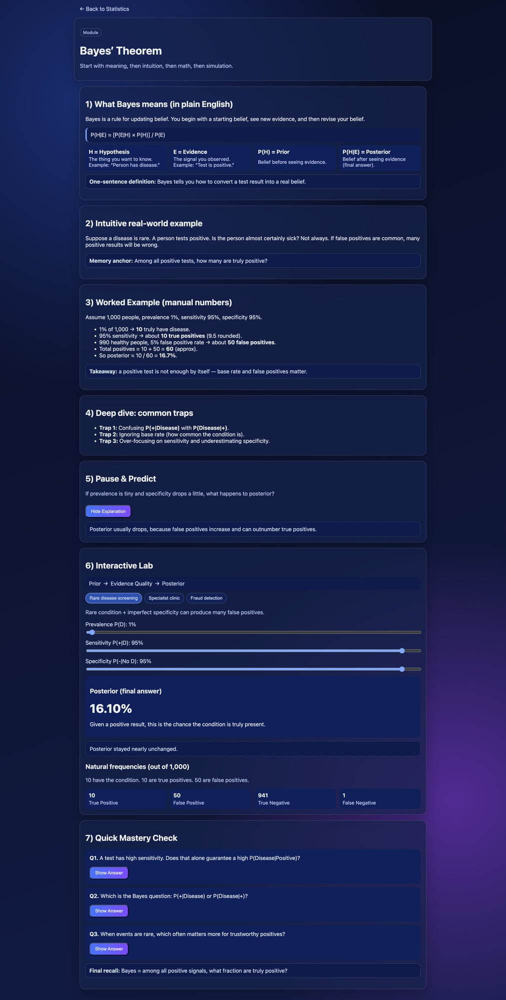

# Data Science Academy (React)

An interactive learning platform for **Statistics**, **Machine Learning**, and **Data Science**.

The current release includes a complete, retention-focused **Bayes’ Theorem** module with:
- definition-first teaching flow
- intuitive real-world explanation
- worked example
- common mistake traps
- interactive simulator
- mastery check quiz



---

## Tech Stack

- **React** (Vite)
- **React Router**
- **Framer Motion**

---

## Routes

- `/` — Academy landing page
- `/statistics` — Statistics track page
- `/statistics/bayes-theorem` — Bayes’ Theorem module

---

## Run Locally

```bash
# 1) Clone
git clone https://github.com/SyedAkramaIrshad/data-science-academy-react.git

# 2) Enter project
cd data-science-academy-react

# 3) Install dependencies
npm install

# 4) Start development server
npm run dev
```

Open the local URL shown in terminal (usually `http://localhost:5173`).

---

## Production Build

```bash
npm run build
npm run preview
```

---

## Project Structure

```text
src/
  pages/
    BayesPage.jsx
    StatisticsPage.jsx
  data/
    scenarios.js
  App.jsx
  main.jsx
```

---

## Vision

This repository is designed to scale into a full modular academy where each topic follows a consistent format:
1. Definition
2. Intuition
3. Deep Dive
4. Interactive Practice
5. Retention Check
